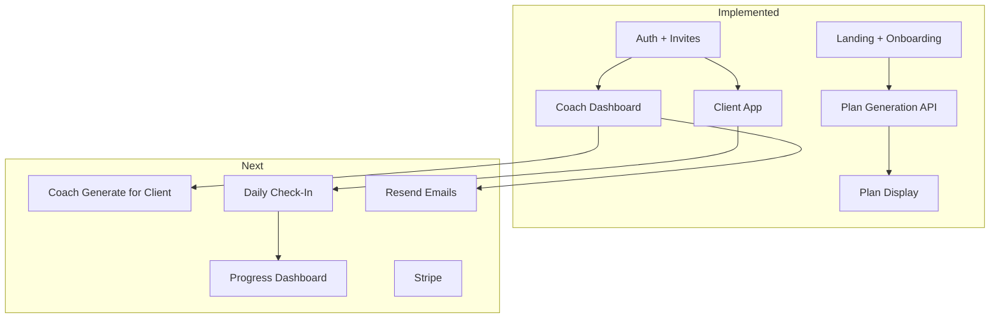

# NutriCoach Platform — Status Report & Next Steps

## What's Done

### Phase 1: Foundation (Complete)

- Next.js 14 with TypeScript and Tailwind
- Design system: CSS variables, Tailwind config, Syne + DM Sans fonts
- UI components: Button, Badge, Card, SectionLabel, SectionTitle
- Landing page: Nav, Hero, Features, Pricing, FinalCta, Footer
- Onboarding form embedded on home page (id="build")

### Phase 2: Onboarding Flow (Complete)

- Multi-step form: Stats (FormStep1), Lifestyle (FormStep2), Review (FormStep3)
- Step indicator, progress bar, form validation
- Supabase schema: profiles, coaches, clients, meal_plans, checkins
- Supabase Auth (email; OAuth via callback route)
- RLS policies and migrations

### Phase 3: AI Plan Generation (Complete)

- API route `[src/app/api/plans/generate/route.ts](src/app/api/plans/generate/route.ts)`: Claude API, JSON parsing, validation
- Plan output UI: PlanSummaryCards, PlanTabs (Meals, Supplements, Shopping, Workout)
- Edamam macro validation (optional when env vars set)
- Plans stored in `meal_plans` when user is authenticated

### Phase 4: Auth & User Flows (Complete)

- Supabase Auth wired; middleware protects `/coach`, `/app`
- Coach onboarding: name, brand name, logo upload
- Client invite system: coach creates invite, gets shareable link (manual copy; no Resend email yet)
- Invite accept flow: `[/invite/accept](src/app/invite/accept/page.tsx)` validates token, creates client + profile on signup

### Phase 5: Core Features (Mostly Complete)

- Coach dashboard: client roster, pending invites, AddClientForm, **Generate plan for client** (with `current_plan_id` update)
- Client app: `[/app](src/app/app/page.tsx)` shows My Plan or onboarding form
- **CheckInForm** and **ProgressDashboard** implemented (weight chart, streak, summary cards)
- **Missing**: Supplement Matcher

### Phase 6: Polish & Launch Prep (Not Started)

- Stripe, PDF export, Resend emails, PostHog analytics — none implemented

---

## What's Next (Recommended Order)

### 1. Coach "Generate Plan" for Client (Phase 5.1)

Add an action on the coach dashboard to generate a plan for a client using that client's profile. Coach selects client → system loads profile from `profiles` → calls `/api/plans/generate` with `client_id` → stores plan linked to client.

**Key files**: `[src/app/coach/dashboard/page.tsx](src/app/coach/dashboard/page.tsx)`, new API variant or param for `client_id`, `[src/lib/plan-mapping.ts](src/lib/plan-mapping.ts)` (profile → PlanGenerationInput)

### 2. Daily Check-In Form (Phase 5.2)

Client-facing form: weight, water, calories, protein, workout done, energy level. Submit to `checkins` table. Add to `/app` when client has an active plan.

**Key files**: New `CheckInForm` component, API route `POST /api/checkins`, `[src/app/app/AppContent.tsx](src/app/app/AppContent.tsx)`

### 3. Progress Dashboard (Phase 5.2)

Simple client view: weight chart (from checkins), streak, summary card. Can use a lightweight chart lib or CSS.

### 4. Resend for Invite Emails (Phase 6.4)

Replace manual link copy with Resend: coach adds client → API creates invite and sends email with magic link. Requires Resend API key and template.

### 5. Stripe Integration (Phase 6.1)

Subscription tiers (Individual, Coach Starter, Pro, Agency), free trial, webhooks. Largest scope; can be deferred until after check-ins and progress.

---

## Architecture Snapshot

---

## Quick Reference: Plan vs Codebase

| Plan Phase             | Status   | Notes                                 |
| ---------------------- | -------- | ------------------------------------- |
| 1.1–1.3                | Done     | Design system, landing                |
| 2.1 Multi-step form    | Done     | OnboardingForm on home + /app         |
| 2.2 Supabase           | Done     | Schema, auth, RLS                     |
| 3.1 Plan API           | Done     | Claude, Edamam optional               |
| 3.2 Plan output UI     | Done     | Tabs, summary, meal/supp/shop/workout |
| 4.1–4.3 Auth & flows   | Done     | Invite link (no email yet)            |
| 5.1 Coach dashboard    | Done     | Generate for client + current_plan_id |
| 5.2 Client experience  | Done     | CheckInForm, ProgressDashboard        |
| 5.3 Supplement Matcher | Not done |                                       |
| 6.1–6.4 Polish         | Not done | Stripe, PDF, Resend, PostHog          |

